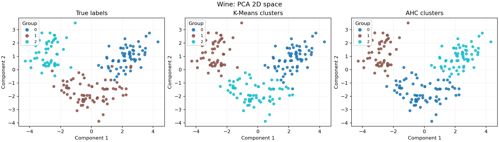
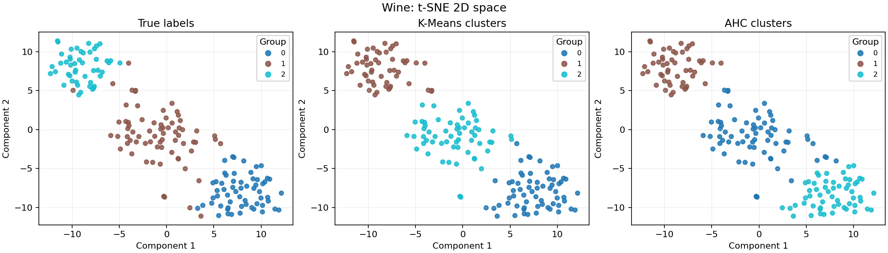
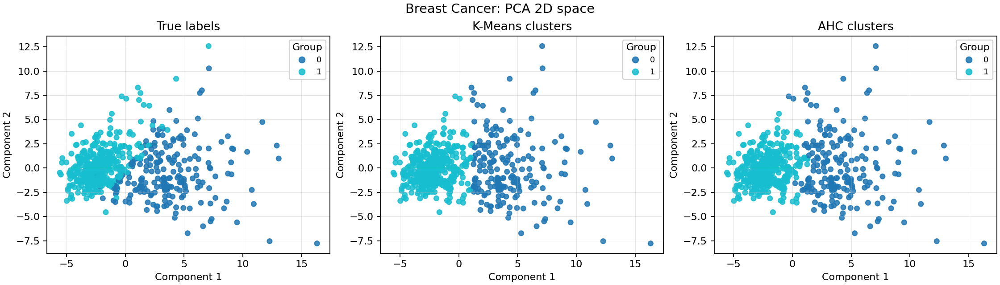
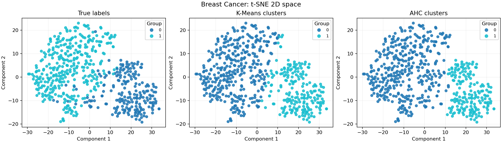

# Labwork 3: Clustering and K-Means on Subspace

## Datasets

Two labeled datasets are used from scikit-learn:

- Wine: 178 samples, 13 numeric features, 3 wine cultivar classes.
- Breast Cancer Wisconsin: 569 samples, 30 numeric features, 2 diagnosis classes.

The class labels are not used during clustering. They are used only after training to evaluate how well the unsupervised clusters match known classes.

## Metrics

- ARI and NMI compare predicted clusters with the true labels. Higher is better.
- Homogeneity and completeness measure whether clusters contain one class and whether each class is assigned mostly to one cluster. Higher is better.
- Silhouette uses only feature geometry and does not need labels. Higher is better, with values near 1 indicating better separated clusters.

## Wine

| Dataset | Space | Method | ARI | NMI | Homogeneity | Completeness | Silhouette |
| --- | --- | --- | --- | --- | --- | --- | --- |
| Wine | Original | AHC | 0.7899 | 0.7865 | 0.7904 | 0.7825 | 0.2774 |
| Wine | Original | K-Means | 0.8975 | 0.8759 | 0.8788 | 0.8730 | 0.2849 |
| Wine | PCA | AHC | 0.8961 | 0.8583 | 0.8590 | 0.8576 | 0.5591 |
| Wine | PCA | K-Means | 0.8951 | 0.8821 | 0.8840 | 0.8802 | 0.5611 |
| Wine | SVD | AHC | 0.8961 | 0.8583 | 0.8590 | 0.8576 | 0.5591 |
| Wine | SVD | K-Means | 0.8951 | 0.8821 | 0.8840 | 0.8802 | 0.5611 |
| Wine | t-SNE | AHC | 0.8474 | 0.8154 | 0.8168 | 0.8140 | 0.5771 |
| Wine | t-SNE | K-Means | 0.8349 | 0.8215 | 0.8255 | 0.8176 | 0.6043 |

### Comments

- On Wine, the best original-space result is K-Means with ARI=0.897 and NMI=0.876.
- The best reduced-space result is AHC on PCA with ARI=0.896 and NMI=0.858.
- Reduced and original spaces perform similarly, so the 2D projection preserves much of the cluster structure.
- The weakest result is AHC on Original with ARI=0.790; this is visible in the plots when clusters overlap.

### Visualizations

## Breast Cancer

| Dataset | Space | Method | ARI | NMI | Homogeneity | Completeness | Silhouette |
| --- | --- | --- | --- | --- | --- | --- | --- |
| Breast Cancer | Original | AHC | 0.5750 | 0.4569 | 0.4462 | 0.4681 | 0.3394 |
| Breast Cancer | Original | K-Means | 0.6707 | 0.5546 | 0.5443 | 0.5654 | 0.3450 |
| Breast Cancer | PCA | AHC | 0.6594 | 0.5380 | 0.5309 | 0.5454 | 0.5046 |
| Breast Cancer | PCA | K-Means | 0.6592 | 0.5404 | 0.5313 | 0.5498 | 0.5085 |
| Breast Cancer | SVD | AHC | 0.6594 | 0.5380 | 0.5309 | 0.5454 | 0.5046 |
| Breast Cancer | SVD | K-Means | 0.6592 | 0.5404 | 0.5313 | 0.5498 | 0.5085 |
| Breast Cancer | t-SNE | AHC | 0.7297 | 0.6472 | 0.6274 | 0.6683 | 0.4984 |
| Breast Cancer | t-SNE | K-Means | 0.7800 | 0.6683 | 0.6649 | 0.6718 | 0.5028 |

### Comments

- On Breast Cancer, the best original-space result is K-Means with ARI=0.671 and NMI=0.555.
- The best reduced-space result is K-Means on t-SNE with ARI=0.780 and NMI=0.668.
- Dimensionality reduction improves clustering here, likely because noise or redundant features are compressed.
- The weakest result is AHC on Original with ARI=0.575; this is visible in the plots when clusters overlap.

### Visualizations

## Overall Conclusion

K-Means and AHC can be trained directly on unlabeled feature data. Labels are useful only for external validation. Performance depends strongly on whether the actual classes form compact geometric groups. PCA and SVD often preserve global structure, while t-SNE can create clear 2D visual separation but may not always improve clustering metrics because its embedding is optimized for visualization rather than clustering.
